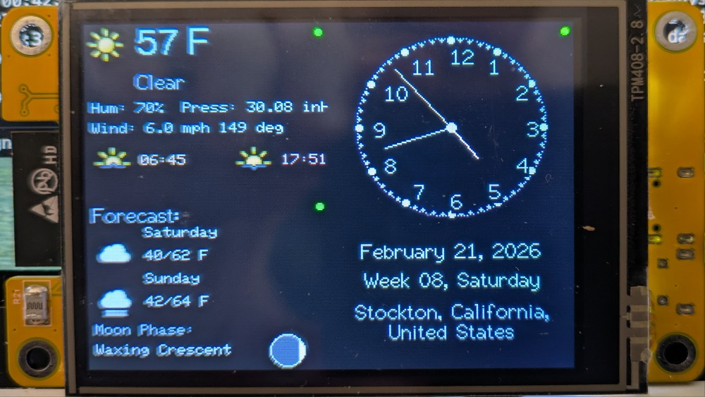

# ESP32 Widget Dashboard (DSL-Only)

ESP32 + ILI9341 + XPT2046 dashboard using a JSON screen layout and JSON widget DSL files.

  

Initial widget layout inspiration: [lachimalaif/DataDisplay-V1-instalator](https://github.com/lachimalaif/DataDisplay-V1-instalator).

Session restart docs:

- `CONTEXT.md`
- `docs/HANDOFF.md`

## Current architecture

- Active layout profiles: `data/screen_layout_a.json`, `data/screen_layout_b.json`
- Legacy layout file (kept for compatibility): `data/screen_layout.json`
- Widget type: `dsl` only
- Widget runtime: `src/widgets/DslWidget.*`
- Layout loader: `src/core/DisplayManager.*`
- HTTP JSON client: `src/services/HttpJsonClient.*`
- Geo + timezone bootstrap: `src/services/GeoIpService.*`, `src/core/RuntimeGeo.*`

Legacy flat manifests and legacy hardcoded widget classes were removed.

## Upload

1. `pio run -t uploadfs`
2. `pio run -t upload`
3. `pio device monitor`

## Browser DSL Editor

Fast local iteration without reflashing:

1. From project root: `python3 -m http.server 8000`
2. Open: `http://localhost:8000/tools/dsl_editor/`
3. Edit widget DSL JSON and payload JSON; preview updates live.

Features:

- 320x240 landscape screen preview
- JSONEditor (tree + code) via CDN for proper JSON editing and tab/indent
- Runtime prefs controls for `pref.*` (`temp_unit`, `distance_unit`, `clock_24h`) with browser auto-detect and manual override
- Runtime geo controls for `geo.lat`/`geo.lon` with optional browser geolocation fill
- Supports DSL node types: `label`, `value_box`, `progress`, `sparkline`, `icon`, `moon_phase`, `arc`, `line`, `repeat`
- Field-path resolution + basic formatting (`round`, `prefix`, `suffix`, `unit`, `locale`, `tz`)
- Load sample widgets from `data/dsl/`

## Image Conversion Utility (Go)

For arbitrary remote images, use `tools/image_proxy`:

1. `cd tools/image_proxy`
2. Build or run:
   - `go build -o image_proxy .` then `./image_proxy -listen :8085 -cache-ttl 10m -cache-max-entries 256 -user-agent "CoStar-ImageProxy/1.0"`
   - or `go run . -listen :8085 -cache-ttl 10m -cache-max-entries 256 -user-agent "CoStar-ImageProxy/1.0"`
3. Call:
   - `GET /cmh?url=<image_url>&size=<n|WxH>`
   - `GET /mdi?icon=<mdi_name>&size=<n|WxH>&color=<RRGGBB>`
   - Returns raw `rgb565le` bytes (`width * height * 2`)

Current project relay endpoint (shared dev host):

- `http://vps.gorkos.net:8085`

Quick example:

- `curl -L "http://localhost:8085/cmh?url=https://example.com/pic.png&size=64" --output pic_64.raw`
- `curl -L "http://localhost:8085/mdi?icon=mdi:weather-partly-cloudy&size=28&color=FFFFFF" --output mdi_weather_partly_cloudy.raw`

For stricter upstream hosts, `/cmh` also supports per-request overrides:

- `ua=<User-Agent>`
- `referer=<Referer>`

See `tools/image_proxy/README.md` for full details.

## Screen layout format

`data/screen_layout_a.json` and `data/screen_layout_b.json` define:

- `screen`: metadata + `regions[]` with exact `x/y/w/h`
- `widget_defs`: reusable widget definitions

The runtime profile selection is persisted in NVS (`layout.profile`) and toggled using the USER button.

Each region points at a widget def by key:

- region: `{ "id": "...", "widget": "weather", "x": ..., "y": ..., "w": ..., "h": ... }`
- widget def: `{ "type": "dsl", "update_ms": ..., "settings": { "dsl_path": "...", ... } }`

## DSL format (v1)

Each DSL file in `data/dsl/` supports:

- `version: 1`
- `data.source`: `http` or `local_time`
- `data.url` (for `http`)
- `data.headers` (optional, for `http`; key/value headers such as `Authorization`)
- `data.poll_ms`
- `data.debug` (or widget setting `debug=true` override)
- `data.fields`: JSON path selectors with optional formatting
- `ui.nodes`: `label`, `value_box`, `progress`, `sparkline`, `icon`, `moon_phase`, `arc`, `line`, `repeat`

Field-path sort transforms:

- `sort_num(array_path,key_path[,asc|desc])`
- `sort_alpha(array_path,key_path[,asc|desc])`
- `distance_sort(array_path,origin_lat,origin_lon[,asc|desc])` (alias: `sort_distance(...)`)
- `asc` is default; `desc`, `reverse`, and `rev` all reverse order.
- Use `.` or `*` as `key_path` to sort by each array element directly.
- `distance_sort` expects array elements to be JSON objects with `lat` and `lon`.
- `origin_lat`/`origin_lon` can be numeric literals or resolvable paths/template values.
- You can continue path resolution after the sort call.
- Examples:
  - `sort_num(aircraft,distance_m,asc)[0].flight`
  - `sort_num(aircraft,.,desc)[0]`
  - `sort_alpha(aircraft,callsign,desc)[0].callsign`
  - `distance_sort(ac,{{geo.lat}},{{geo.lon}},asc)[0].flight`

Template bindings:

- Widget field bindings: `{{field_name}}`
  - Comes from that widget's own `data.fields` only (not shared across widgets).
- Global runtime bindings (shared across widgets):
  - `{{geo.lat}}`, `{{geo.lon}}`, `{{geo.tz}}`, `{{geo.offset_min}}`, `{{geo.label}}`
  - `{{pref.clock_24h}}`, `{{pref.temp_unit}}`, `{{pref.distance_unit}}`
- Widget settings bindings (per-widget, not global):
  - `{{setting.<key>}}` from the widget's own `widget_defs.<id>.settings`
  - `{{setting.radius_nm}}` can be overridden by runtime ADS-B radius setting when set

Where runtime bindings are resolved:

- `data.url`
- `data.headers.<header>`
- `data.fields.<field>.path`
- `data.fields.<field>.format`: `prefix`, `suffix`, `unit`, `locale`, `tz`, `time_format`
- UI node strings: `text`, `key`, `path`/`icon`, `angle_expr`

Direct Home Assistant (no intermediary):

- Use a long-lived access token in widget settings and pass it via `data.headers.Authorization`.
- Keep payloads small by targeting one entity endpoint:
  - `{{setting.ha_base_url}}/api/states/{{setting.entity_id}}`
- Example DSL: `data/dsl/homeassistant_entity.json`
- Example widget settings:
  - `dsl_path`: `/dsl/homeassistant_entity.json`
  - `ha_base_url`: `http://homeassistant.local:8123`
  - `entity_id`: `sensor.outdoor_temperature`
  - `ha_token`: `<LONG_LIVED_ACCESS_TOKEN>`

Remote icon URLs (auto-cached to LittleFS):

- `icon`/`path` nodes can use `http://` or `https://` raw RGB565 URLs.
- Render path checks LittleFS first; on cache miss it downloads once, stores to `/icon_cache/*.raw`, then reuses local file.
- Recommended for HA MDI:
  - Field: `"ha_icon": "attributes.icon"` (e.g. `mdi:weather-partly-cloudy`)
  - Node path: `"http://vps.gorkos.net:8085/mdi?icon={{ha_icon}}&size=28&color=FFFFFF"`
- Keep node `w`/`h` matched to requested `size` (or exact `WxH`) for predictable bytes (`w*h*2`).

`local_time` source fields (for `data.source: "local_time"`):

- `time`, `time_24`, `time_12`, `date`, `iso_local`
- `hour`, `minute`, `second`, `millis`, `epoch`
- `tz`, `offset_min`, `offset_known`

Label alignment:

- `align`: `left`, `center`, `right`
- `valign`: `top`, `middle`, `bottom`, `baseline`

Label wrapping:

- Enable with `wrap: true` on a `label` node.
- Set wrap width with `w` (pixels).
- Optional controls:
  - `line_height` (pixels, default = font height)
  - `max_lines` (cap rendered lines)
  - `overflow`: `clip` (default) or `ellipsis`
- Optional `h` limits lines by available pixel height (`floor(h / line_height)`).

Label runtime path binding:

- `label` nodes can set `path` to resolve text directly from source payload at runtime.
- If `text` is empty, the resolved value is drawn directly.
- If `text` contains `{{value}}`, that token is replaced by the resolved value.
- Works well with `repeat` to render rows without defining `f1`/`f2`/`f3` field keys.

Repeat nodes (advanced):

- Use `"type": "repeat"` to expand a node (or list of nodes) at parse time.
- Fields: `count` (or `times`), `start`, `step`, `var` (default `i`), and `nodes` (array) or `node` (single object).
- The repeat variable is available in numeric expressions (e.g. `"x": "80 + cos(i*6-90)*60"`) and in text/path via `{{i}}`.
- Safety: repeat expansion is capped at 512 iterations per node.

Numeric expressions (advanced):

- String-valued numeric fields (`x`, `y`, `x2`, `y2`, `r`, `length`, `thickness`, `min`, `max`, `start_deg`, `end_deg`) may contain arithmetic.
- Supported functions: `sin`, `cos`, `tan`, `asin`, `acos`, `atan` (degrees), `abs`, `sqrt`, `floor`, `ceil`, `round`, `min`, `max`, `pow`, `rad`, `deg`, `haversine_m`, `meters_to_miles`, `miles_to_meters`, and constant `pi`.

Format units:

- `unit: "pressure"` pins to temperature units (`F` → `inHg`, `C` → `hPa`).

## Runtime notes

- Rendering and network fetches are split across ESP32 cores.
- Screen updates stay responsive while HTTP fetches run.
- Manual location entered from Setup (`City / Locale` or `Lat / Lon`) is now saved per connected Wi-Fi SSID in LittleFS (`/geo_manual_by_ssid.json`).
- On boot, SSID-matched manual location is preferred; otherwise legacy global manual override/cached Geo-IP behavior remains.
- USER button (`GPIO 0`, active-low) toggles between `/screen_layout_a.json` and `/screen_layout_b.json`; selected layout profile is saved in NVS and reloaded on boot.
- Remote icon URLs in DSL `icon/path` are auto-cached to LittleFS under `/icon_cache/*.raw` on first successful fetch.
- Widget health indicator is a 5px dot:
  - green = `ok`
  - red = non-OK

## Third-party assets

- Meteocons weather icons by Bas Milius (MIT License).
  - Source: https://github.com/basmilius/weather-icons
  - License text: `third_party/meteocons/LICENSE`

## Widget Ideas
- NASCAR Race feed
- Network TV Guide
- Meshtastic Live feed (MQTT?)
- Traffic/Incident Feed localized
- Transit Arrival/Departure
