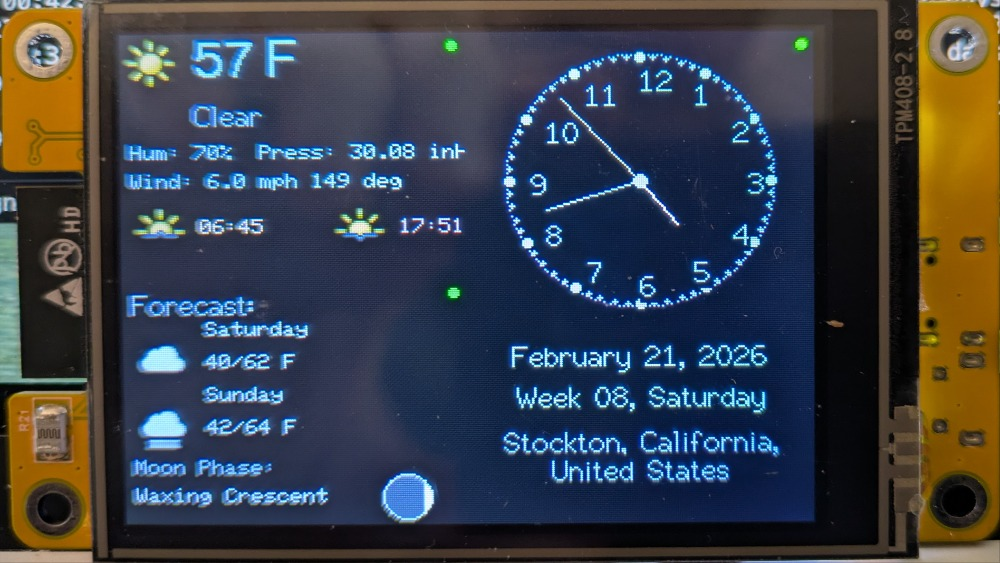

# CoStar: ESP32 Live Information Dashboard

CoStar turns an ESP32 + 320x240 TFT into a compact, always-on information panel.
It is designed for fast iteration: you can change what appears on screen by editing JSON files instead of rewriting firmware.

<p align="center">
  
</p>

Initial widget layout inspiration: [lachimalaif/DataDisplay-V1-instalator](https://github.com/lachimalaif/DataDisplay-V1-instalator).

## Why flash this?

- Build a custom wall/status display without writing custom widget classes.
- Mix local device info, internet APIs, and Home Assistant in one screen.
- Move from idea to on-screen result quickly using JSON + browser preview.
- Keep it maintainable: layout, data mapping, and rendering are all declarative.

## What can you display?

Almost anything that can be fetched as JSON (or computed locally), including:

- Weather now + forecast
- Clocks (digital and analog)
- Home Assistant entities (state, label, icon)
- ADS-B nearby flights (sorted by distance)
- Crypto prices
- Moon phase and day/date info
- Any external image or icon converted to display-friendly format

The runtime supports four layout screens and switches between them from the on-screen touch menu:

- `screen_layout_a.json`
- `screen_layout_b.json`
- `screen_layout_nyt.json`
- `screen_layout_quakes.json`

The selected layout is persisted in NVS (`ui/layout`).

## JSON DSL highlights

The on-screen UI is described with JSON nodes and drawing primitives.
You can compose rich widgets from:

- `label`, `value_box`
- `line`, `arc`
- `progress`, `sparkline`
- `icon`, `moon_phase`
- `repeat` (generate rows/items without copy-paste)

Data and UI are connected through template bindings and field extraction:

- Bind text/values with `{{field}}`, `{{geo.*}}`, `{{pref.*}}`, `{{setting.*}}`
- Pull nested JSON paths from API payloads
- Sort and filter list data (`sort_num`, `sort_alpha`, `distance_sort`)
- Use expressions (including distance math) for runtime positioning and calculations
- Wrap long text labels with width/line controls
- Control TLS verification per widget with `data.tls_skip_verify` (use carefully)

## Home Assistant support

CoStar can query Home Assistant directly from the ESP32 over HTTPS (`"source": "http"`), and supports a shared websocket mode (`"source": "websocket"`).
Current HA card DSLs in `data/dsl_available/` are configured to use websocket.

CoStar also supports a generic shared websocket data source (`"source": "websocket"`), so multiple widgets can:
- Share one screen-level websocket connection
- Authenticate (`ws_token` + optional `auth_message`)
- Send bootstrap/subscribe JSON messages
- Consume async server events via configurable `result_path` / `event_path`
- Bind to shared connection profiles from `shared_settings.ws_profiles` using
  `data.connection_profile` (or widget setting `connection_profile`) so backend-specific
  init/auth protocol details stay out of widget DSL/UI definitions.

Tap actions support `refresh`, `http`, and `ws_publish`.

### TLS skip-verify flag

For private endpoints with self-signed certificates (common with Home Assistant),
widgets can opt in to skipping TLS certificate verification:

```json
{
  "data": {
    "source": "websocket",
    "tls_skip_verify": true
  }
}
```

This is a per-widget setting (not required globally). It reduces connection safety,
so leave it `false` for public internet APIs.

## Quick start

1. Install dependencies (PlatformIO + board support as usual).
2. Put your layout/DSL JSON files in `data/`.
3. Flash assets and firmware:
   1. `pio run -t uploadfs`
   2. `pio run -e esp32dev_idf -t upload`
   3. `pio device monitor`

Note: if you changed anything in `data/` (layouts, DSL, icons), run `uploadfs` before flashing firmware.

## Browser editor (fast iteration)

Preview and tune DSL widgets without reflashing:

1. `python3 -m http.server 8000`
2. Open `http://localhost:8000/tools/dsl_editor/`
3. Edit DSL JSON and sample payload JSON side-by-side

This is the fastest way to dial in fonts, spacing, wrapping, and API mappings before deploying to hardware.

## Optional image proxy (for arbitrary icons/images)

`tools/image_proxy` can fetch remote images, resize them, and return display-ready RGB565 raw bytes.
This is useful for MDI icons and external logos without embedding image decoders on the ESP32.

- Build/run details: `tools/image_proxy/README.md`
- Shared dev relay currently used by this project: `http://vps.gorkos.net:8085`

## Project docs

- `HANDOFF.md`: current handoff/runbook and runtime status
- `docs/dsl_user_guide.md`: DSL structure, source types, and `tls_skip_verify`
- `docs/ws_connection_profiles.md`: websocket profile schema and resolution behavior
- `docs/dsl_transforms_and_visibility.md`: transform ops, visibility rules, bitmap node notes
- `CONTEXT.md`: older deep context notes (parts may be stale)

If you are hacking on internals, start with `HANDOFF.md` and then use the focused docs under `docs/`.

## Third-party assets

- Meteocons weather icons by Bas Milius (MIT License)
  - Source: https://github.com/basmilius/weather-icons
  - License text: `third_party/meteocons/LICENSE`
